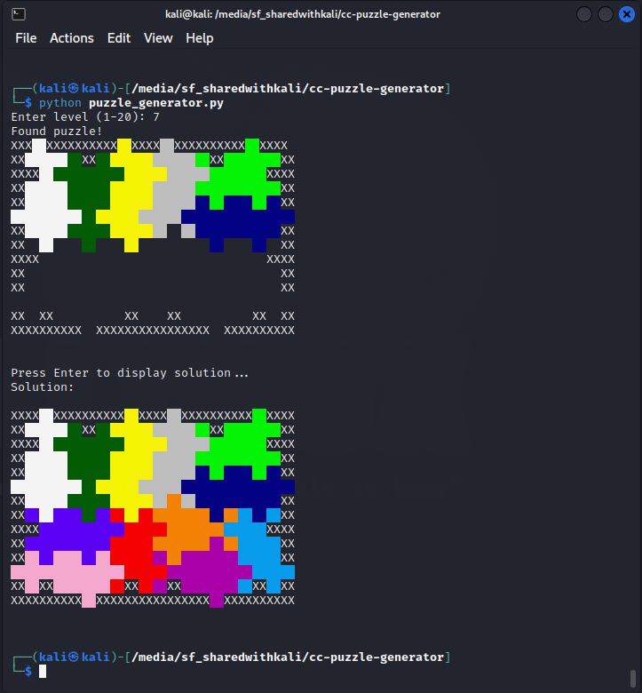

# Lonpos Cosmic Creature Puzzle Generator

Welcome to the [Lonpos Cosmic Creature](https://www.lonpos.com.au/products/lonpos-cosmic-creature-cosmic-challenge) Puzzle Generator repository! This project aims to use the existing [Lonpos Cosmic Creature puzzle solver](https://github.com/johannestoger/cc-solver) into a puzzle generator, that crafts Lonpos Cosmic Creature challenges, each with a distinct and solvable solution. Lonpos Cosmic Creature is a challenging and engaging puzzle game that requires players to arrange colorful cosmic creatures within a grid, following specific rules and patterns.

## Dependencies:
* clang++ 3.1 or g++ 4.2
* Eigen 3.4.0, see http://eigen.tuxfamily.org

## How to run:
1. Download [Eigen 3.4.0](https://gitlab.com/libeigen/eigen/-/releases/3.4.0). It's a C++ template library, so just unpack it in some directory.
1. Set the include path of Eigen in Makefile to the directory you unpacked Eigen into.
1. Run make
1. Run "python puzzle_generator.py".

## License
This code is released under the GNU General Public Licence v3 (see LICENSE).
